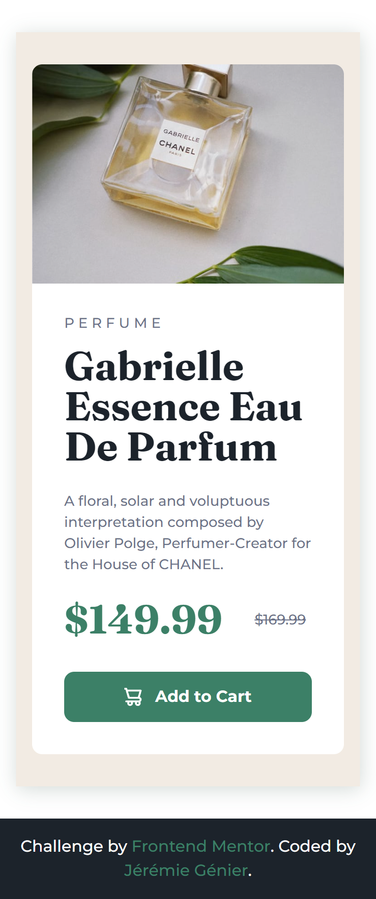
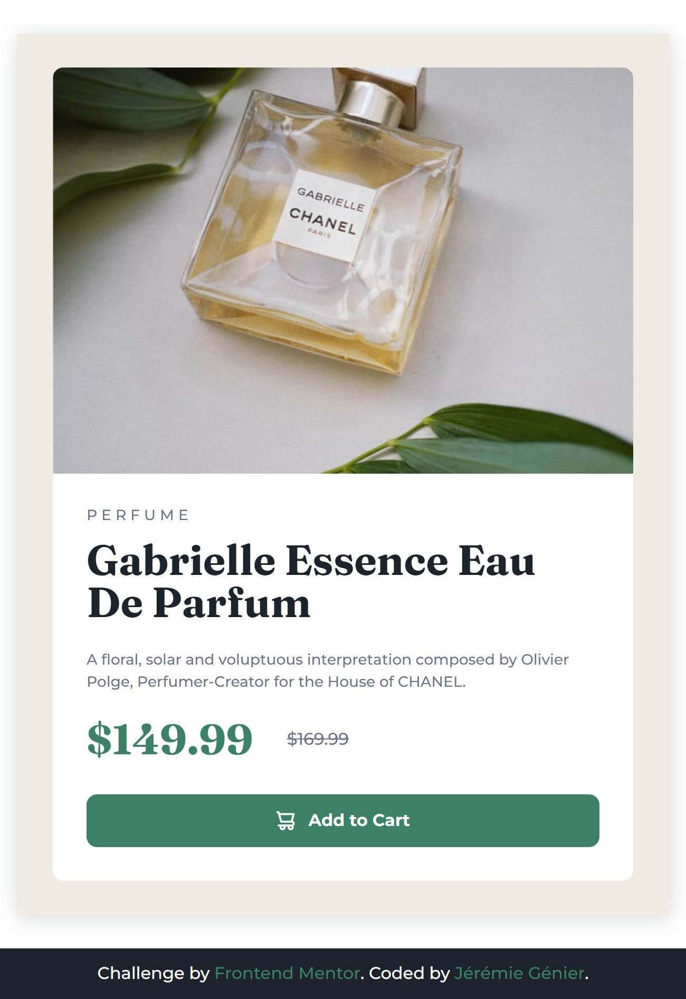
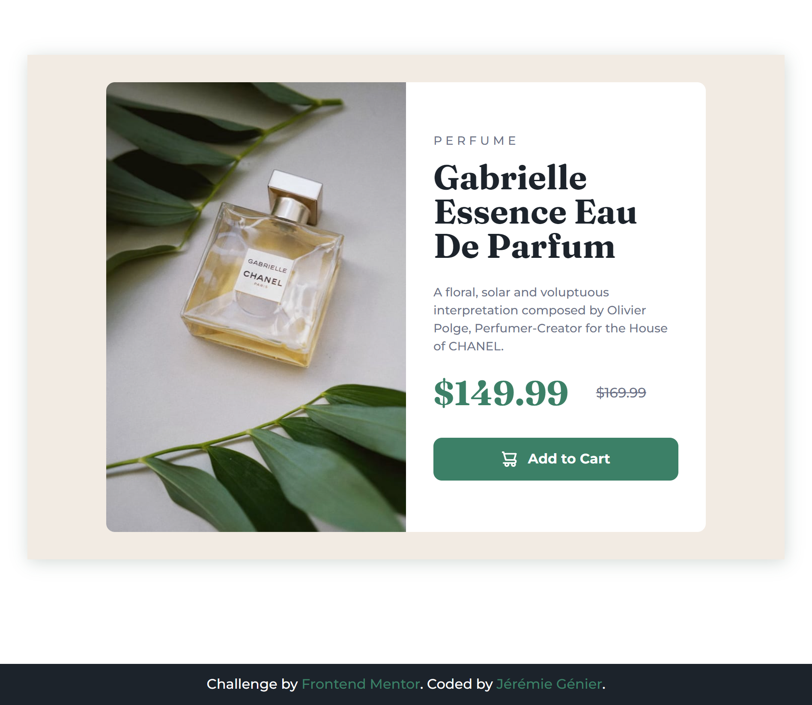
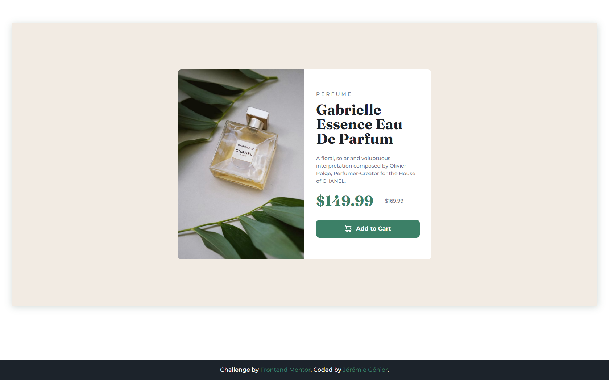

# Frontend Mentor - Product preview card component solution

This is a solution to the [Product preview card component challenge on Frontend Mentor](https://www.frontendmentor.io/challenges/product-preview-card-component-GO7UmttRfa). Frontend Mentor challenges help you improve your coding skills by building realistic projects. 

## Table of contents

- [Overview](#overview)
  - [The challenge](#the-challenge)
  - [Screenshots](#screenshots)
  - [Links](#links)
- [My process](#my-process)
  - [Built with](#built-with)
  - [What I learned](#what-i-learned)
  - [Softwares used](#softwares-used)
  - [Continued development](#continued-development)
  - [Useful resources](#useful-resources)
- [Author](#author)


## Overview

### The challenge

Users should be able to:

- View the optimal layout depending on their device's screen size
- See hover and focus states for interactive elements

### Screenshots







### Links

- Solution URL: [Add solution URL here](https://your-solution-url.com)
- Live Site URL: https://jeremiegenier.github.io/FrontEndMentor-Product-Card-Challenge/

## My process

### Built with

- Semantic HTML5 markup
- CSS custom properties
- Flexbox
- Mobile-first workflow
- SCSS

### Softwares used

- Koala (SCSS compiler)

### What I learned

I didn't really learned verry much as I already knew most of the elements i used, but I learned how to use the
```html : <Picture> ``` element in my code. Background images would've been an easier solution but because the image is part of the main content of the page I tried my best to keep it into the HTML instead of the CSS. I also learned how to make a globally acessible website from github. This was a good warm up to remember what I learned during classes.

### Continued development

The ```html : <Picture> ``` element is something that I still need some practice with as I couldn't fix the "flicker" effect when resizing the browser. (Image taking the full size of the container it is in an )

### Useful resources

- [Bootstrap](https://getbootstrap.com/) - The bootstrap breakpoints are were pretty usefull to choose when to add breakpoints.
- [Chrome screenshots](https://zapier.com/blog/full-page-screenshots-in-chrome/) - This article was pretty useful to make screenshots directly from chrome.
- [Github hosting](https://www.khanacademy.org/computing/computer-programming/html-css/web-development-tools/a/hosting-your-website-on-github) - Best resource for explanation how to host your pages directly from github.

## Author

- Jérémie Génier
- Frontend Mentor - [@jeremiegenier](https://www.frontendmentor.io/profile/jeremiegenier)